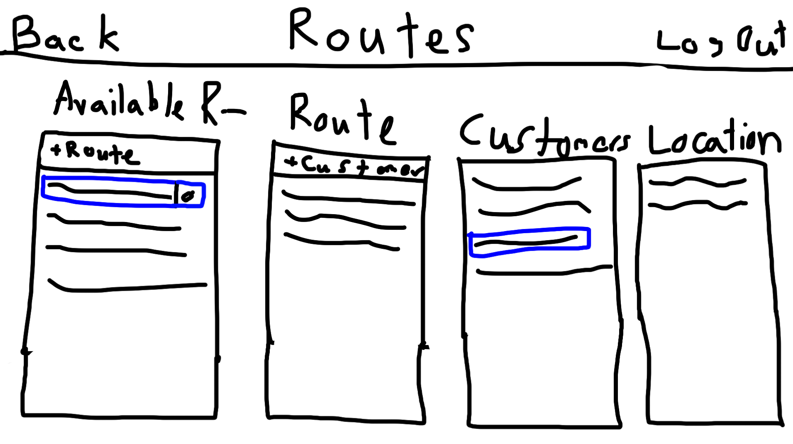

# Landscape Manager

## What is this?

This landscape manager is a software built for business owners, particularly in the landscaping industry. It allows businesses to manage routes, and invoice their customers while keeping track of outstanding debts. The invoice feature is tied to routes to allow for extremely simple and quick creation of invoices.

This project is built with:

-   [Svelte](https://svelte.dev/) ([SvelteKit](https://kit.svelte.dev/))
-   [Bootstrap](https://getbootstrap.com/)
-   [Typescript](https://www.typescriptlang.org/)
-   [Express](https://expressjs.com/)
-   [MySQL](https://www.mysql.com/)

---

## Functionality

Below are all the separate tabs and how they tie into the system

### Customers

Users can add new customers into the system. By default, the new customer would also be instantiated with a location tied to their residence. Customers can have multiple locations tied to them, which can be inserted and deleted on a per customer basis. An example of multiple locations is a local business owner, where their personal property is services as well as their business.

After selecting a customer to modify, locations could be added or removed, and services could be added or removed from each individual location. When a service is added to a location, the user will generate the cost of performing that service. This allows the user to be extremely flexible with differing costs between the services they offer without having to create many copies of the same service. Lawn care on a 2 acre property costs a lot more than lawn care on a small front yard.

### Services

Here, the user will list all the available services they offer. Ex: "Lawn Care", "Hedge Trimming" etc.
These services are used in the Customers tab to add to each individual location under said customer.

### Routes

The user can create many different routes. After creating a new route and titling it, locations can be added to that route. The user will first select the customer from a list, and then select the location they would like to add to this route. These routes can then be printed out to give to the landscaping crews, as well as saved in the system for generating invoices later on.

### Enter Charges

This is where users will add charges on either individual customers or across an entire route. Once a route is selected, a list of all locations on that route is brought up. The user will select the date they are charging for, then go through every Location and mark / unmark if a given service was performed that day. There is also a global mark option to mark every location with a given service with the value selected. The user may also modify the service cost under this tab, which will not be saved permanently, and will only be used in the creation of this invoice. The user will then hit the "Enter Charges" button to update the charges on every customer whose location got services above.

### Generate Invoice

Here the user can select a customer and a time period which will look at all the charges entered in a given time period and generate an invoice based on the charges entered between those dates. Once the user is happy with their invoice, they can press the "Generate Invoice" button which will return a PDF to be saved. Every invoice will be saved to refer back to.

### Invoices

This tab functions only as a store to look back at previous invoices, sorted and searchable by the date they were generated for.

### Balance Sheet

Here the user can view the current balance of every customer, where they may find some customers haven't payed for a while in which case they could be contacted.

### Receive Payment

This is where the user marks to the system that a customer has payed some amount to the business. The user can enter the date and the amount being payed, where the date will default to the current date. After the "Receive Payment" button is pressed, the amount payed will be added to the current balance of the customer. This allows customers to pay extra money in advance to keep a credit system on file with the business.

---

## Bugs/Important Information

-   **IMPORTANT: All of the above features (besides the "Services" tab) are not yet implemented in the system, but this provides a general outline of what the software will become.**
-   The database is 90% complete, with the models and controllers in place, they are just not hooked into the frontend due to issues I have been working on resolving.

---

## Running locally

Depends on:

```
nodejs      (>v14.16.1)
npm         (>v6.14.12)
mysql  	    (>v8.0.29)
```

For development:

```sh
cd client
npm install
npm run dev
```

```sh
cd server
npm install
npm run dev
```

The following environment variables must be provided in `server/.env`:

```
DB_HOST
DB_USER
DB_PASSWORD
DB_DATABASE
PORT=3030
```

---

## ER Diagram


Note: Primary Keys will be **bolded** and Foreign Keys _italicized_.

Below I display all attributes and explain in more detail the non-self-explanitory attributes.

## User

The owner or manager of this business who will use this application

-   **UserID**
-   Username
-   Password
-   Email
-   Name
-   Birthday

## Customer

Customers of the business

-   **CustomerID**
-   _UserID_ (To know which user has this customer)
-   _Invoices_
-   CustomerName
-   CustomerAddress (For billing purposes)
-   CustomerBalance (To keep track of how much this customer owes to business)

## Location

Properties/Locations where customers can be Services

-   **LocationID**
-   _CustomerID_ (To know the owner of this location)
-   LocationAddress

## Service

Jobs that get done with differing rates between Locations (No 2 jobs are the same!)

-   **ServiceID**
-   _LocationID_ (To know where this specific service is applied)
-   NameOfService
-   ServiceRate (How much should the customer be charged for this service)

## Available_Services

Used to generate Services on Locations

-   **AvailableServiceID**
-   _UserID_
-   NameOfService

## Routes

List of locations to be services on a certain day or timespan

-   **RouteID**
-   _CustomerID_
-   NameOfRoute

## Invoice

Charges applied to the customer to keep track of the balance sheet

-   **InvoiceID**
-   _CustomerID_
-   InvoiceAmountOwed (These two attributes may change in the future)
-   InvoiceAmoutPayed (^^^)

---

## Current Webpage Images

### Home Page (signed in)


### Login


### Register


## While signed in

### Routes


### Services


---

## Concept Art for future pages

### Home Page


### Customers


### Routes



### Balance Sheet


### Generate Invoice


### Enter Charges


### Receive Payment


